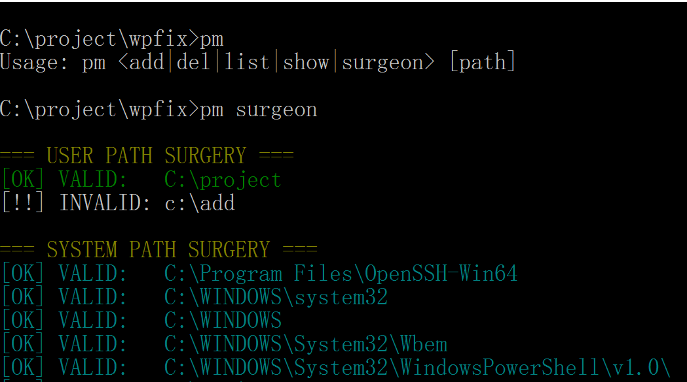
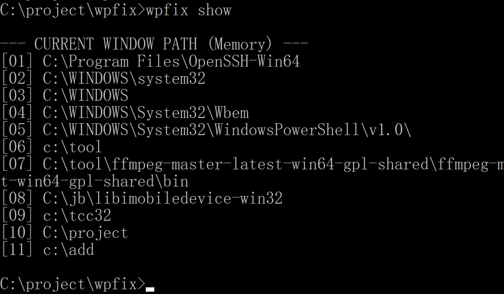

🛠️ wpfix (Windows Path Fixer)
wpfix is a high-performance, zero-dependency CLI tool written in pure C, designed to manage and repair the Windows PATH environment variable with surgical precision.

Unlike the standard setx command, wpfix ensures your PATH remains clean, deduplicated, and instantly synchronized across all active terminal windows without requiring a system reboot.
### 🌟 Why wpfix?

Most Windows developers hate the "restart CMD to refresh PATH" ritual. **wpfix** solves this by using real-time environment synchronization.

- **Instant Sync**: Changes take effect immediately in all running `cmd.exe` windows.
- **Surgeon Mode**: Deep-scan your PATH for broken, missing, or messy entries.
- **Zero Overhead**: Pure C implementation, no dependencies, ultra-fast.

✨ Key Features
Zero Dependencies: A tiny standalone executable. No .NET, Python, or PowerShell overhead.

Surgeon Mode (Full System Scan): Scans both User and System paths.

🟢 Green: Valid User paths.

🔵 Cyan: Valid System paths.

⚪ White: Invalid/Broken paths (Optimized for dark-themed consoles).

  
   
  <b>Diagnostic "Surgeon Mode" identifying broken paths.</b>

Active Sync: Uses Windows Message Broadcasting and Remote Process Injection to update the %PATH% of all currently open cmd.exe windows in real-time.

Smart Sanitization: Automatically handles duplicate entries, trailing backslashes, and messy double semicolons (;;).

Robust Parsing: High tolerance for user input (e.g., handles wpfix add. or wpfix list\ gracefully).

🚀 Installation & Build
Since wpfix is written in pure C, you can compile it using the Tiny C Compiler (TCC) or any standard MinGW/MSVC compiler.

Build with TCC:
Bash

tcc wpfix.c   -IC:\winapi\include\winapi -L"C:\tcc32\lib"    -lkernel32   -luser32 -ladvapi32  -lshell32  -o wpfix.exe

### 💻 Usage Guide

| Command | Description |
| :--- | :--- |
| `wpfix add .` | Add current folder to PATH (instantly synced) |
| `wpfix del .` | Remove current folder **from** PATH (instantly synced) |
| `wpfix surgeon` | Scan and diagnose PATH health (color-coded) |
| `wpfix list` | Show your **clean** User PATH (from Registry) |
| `wpfix show` | Show active PATH in current session |

  
   
  <b>A smart PATH manager for Windows programmers. No more CMD restarts.</b>

1. Adding a Path
Add the current directory or a specific path. It automatically removes existing duplicates before adding.

Bash

wpfix add .
wpfix add C:\Tools\my_bin
2. Removing a Path
Removes a specific directory from the User PATH registry.

Bash

wpfix del C:\Old\Path
3. Surgeon Mode (Diagnostics)
The "Surgeon" command performs a deep health check of your entire environment.

Bash

wpfix surgeon
Identifies broken links (folders that no longer exist) in White.

4. Viewing Paths
Show: Lists paths currently loaded in the active window's memory.

List: Lists paths saved in the Windows Registry (User).

Bash

wpfix show
wpfix list
🔧 Technical Mechanism
wpfix operates on three levels:

Registry Level: Modifies HKEY_CURRENT_USER\Environment directly for persistence.

Broadcast Level: Issues WM_SETTINGCHANGE to notify the OS of environment changes.

Process Level: Injects a temporary synchronization script into all cmd.exe pids to update their local process environment variables immediately.

📜 License
This project is licensed under the MIT License.